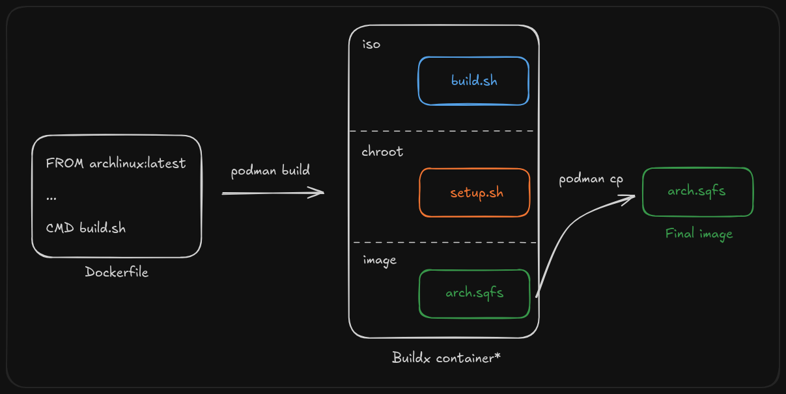

## What is this?

ExpitauOS is an immutable, cloud-native, Arch-based operating system that uses **podman** and **btrfs snapshots** to provide a customizable, personalized, and indestructible distro.

## 1. Installation

### 1.1 Preparing the disk

Download and run an [Arch Linux ISO](https://archlinux.org/download/)

Install necessary dependencies for installation
```bash
pacman -Sy
pacman -S archlinux-keyring
pacman -S git wget
```

Create disk partition layout. **Labels must be exact** (change this in scripts/config/fstab and system/src/entry.conf)
```bash
cfdisk # Make partitions with sizes 1G and 100%
mkfs.vfat /dev/sda1
dosfslabel /dev/sda1 ARCH_BOOT
cryptsetup -v luksFormat /dev/sda2
cryptsetup config /dev/sda2 --label ARCH_ROOT
cryptsetup open /dev/sda2 root
mkfs.btrfs /dev/mapper/root
```

Your partition layout should end up looking like this
```
/dev/sda
 ├──/dev/sda1  ARCH_BOOT  1G    vfat
 └──/dev/sda2  ARCH_ROOT  100%  luks
   └──/dev/mapper/root    100%  btrfs
```

Mount btrfs and create subvolumes
```bash
mount /dev/mapper/root /mnt
btrfs subvolume create /mnt/@root
btrfs subvolume create /mnt/@tmp # For cloning squashfs before install
btrfs subvolume create /mnt/data
```

### 1.2 Unpacking the OS image
Download squashfs image
```bash
cd /mnt/@tmp
curl https://raw.githubusercontent.com/expitau/expitau-os/refs/heads/main/download_sqfs.sh | sh
```

Unpack the squashfs to root subvolume
```bash
unsquashfs -d /mnt/@ /mnt/@tmp/arch.sqfs
```

And we're done using @tmp

```bash
btrfs subvolume delete /mnt/@tmp
```

### 1.3 Installing the bootloader
Mount efi partition and install bootloader
```bash
mount /dev/sda1 /mnt/@/efi
bootctl install --esp-path=/mnt/@/efi
cp /mnt/@/usr/lib/kernel/arch-linux.efi /mnt/@/efi/EFI/Arch/arch-linux.efi
cp /mnt/@/etc/boot-entry.conf /mnt/@/efi/loader/entries/arch-linux.conf # I'm your boot option, edit me!
```

## 2. Configuration

### 2.1 Username & Password
The username is set via an environment variable `SYSTEM_USER`, which should be set in the `.env` file locally or in **Repository > Settings > Secrets and Variables > Actions** for the cloud.

The password is stored as a base64 encoded bcrypt hash. It can be generated with
```bash
mkpasswd "password" | base64 #JHkkajlUJFI3V3dTdVYxbEsxTWdhWlFlVjBsbzAkTkMyaTNjd2ovZnVvZE84UXN4NlptblFWaWhFeE1sa0xjV0dWcmw3UGRyNgo=
```
It is similarly stored as a `SYSTEM_PW` environment variable or repository secret.

### 2.2 Home Directory
The home directory houses many symbolic links that direct persistent data to be stored in `/var/data` (mounted as `data` subvolume on `/dev/mapper/root`). You can configure how it is set up in [data-tmpfile.conf](./scripts/config/data-tmpfile.conf)

### 2.3 Settings
Default gnome settings are stored in [dconf.conf](./scripts/config/dconf.conf), and are copied to etc in the build script. Most customization settings are stored here. You can find your current dconf with
```bash
dconf dump /
```

### 2.4 Personalization
The desktop wallpaper is set in [wallpaper.png](./scripts/config/wallpaper.png)

The user profile icon is set in [icon.png](./scripts/config/icon.png)

A custom PS1 prompt and terminal keybinds are applied in [trueline.sh](./scripts/config/trueline.sh)

### 2.5 Packages & Advanced Configuration

Most configuration should be done in [setup.sh](./scripts/setup.sh). This is how the main system is built, including packages, system services, gnome extensions, and tweaks. [build.sh](./scripts/build.sh) should only be modified to copy scripts before chrooting

<!-- 
This image implements several layers of hardening to make the system more secure, including
- Automatic microcode updates
- Apparmor for manadatory access control
- Immutability by default
- Secure boot signed efi images
- Full disk encryption
- nftables based firewall 
-->

## 3. How it works

### 3.1 Transport mechanism

The entire operating system, including apps, settings, and configuration (but not documents or userdata) is compressed into a **[squashfs](https://wiki.archlinux.org/title/Full_system_backup_with_SquashFS)** file. This is then broken into 1GB chunks so they can be stored in a GitHub release.


The chunks can be pieced back together using the [download_sqfs.sh](./download_sqfs.sh) script, or with

```bash
cat chunks/* > arch.sqfs
```

### 3.2 Build process

The squashfs image is built in two steps. 
1. Podman builds a "builder" image, that acts as the live installer for a traditional arch install. 
2. When this image is run, this image calls the entrypoint [build.sh](./scripts/build.sh), which runs pacstrap, chroots and runs [setup.sh](./scripts/setup.sh), and then compresses the fresh arch installation to a squashfs file.



So, after running, the podman container will have an `arch.sqfs` file in its root directory, which can be copied out of the container and deployed.


When the container image is run, we perform a fairly traditional Arch installation. The only differences are that we skip disk partitioning, and compress to a squashfs image when we are finished. 

> Why not generate the arch.sqfs file directly with `podman build`, skipping the need for a run step?

This is what I attempted initially. However, podman requires special permissions to be able to mount and chroot inside a container (access to the host's `/proc` and ability to map user ids). For reproducibility reasons, these permissions can only be granted when *running* a container, and not when creating an image. While it would be ideal to do everything at build time, this is a suitable workaround. If someone smarter than me is able to find a solution, please [open a merge request](https://github.com/expitau/expitau-os/pulls).

### 3.3 Runtime

There are two main components to the operating system - the root filesystem, and the arch-linux.efi binary.

The root filesystem is all of your userspace. It includes applications, system utilities, and configuration. This is what is mounted at `/`

The efi binary is machine code that can run directly by your firmware. It contains your microcode (CPU security and performance patches), kernel (responsible for providing system calls and interacting with firmware), and your initramfs (responsible for decrypting, mounting, and running your actual system). This is one of the first things that run when booting the OS. 

When the efi binary is run, it accepts a number of [kernel parameters](https://wiki.archlinux.org/title/Kernel_parameters). These are analogous to command-line arguments on a shell script. In our case, we need the following arguments
- `cryptdevice=LABEL=ARCH_ROOT:root` Find the partition with label `ARCH_ROOT`, prompt for a decryption password, and mount the decrypted block device at `/dev/mapper/root`
- `root=/dev/mapper/root` Mount the block device `/dev/mapper/root` as our main filesystem.
- `rootflags=subvol=@root` For the above mount, instead of mounting the root btrfs filesystem, mount the subvolume `@root`
- `rw` Mount it as read-write, instead of mounting as read-only and fixing it later with `/etc/fstab`
- `lsm=landlock,lockdown,yama,integrity,apparmor,bpf` Use AppArmor for mandatory access control.
- `nvidia-drm.modeset=1 nvidia-drm.fbdev=1` Make the system work better with a Nvidia graphics card.

These are set in [/efi/loader/entries/arch-linux.conf](./scripts/config/boot-entry.conf).


